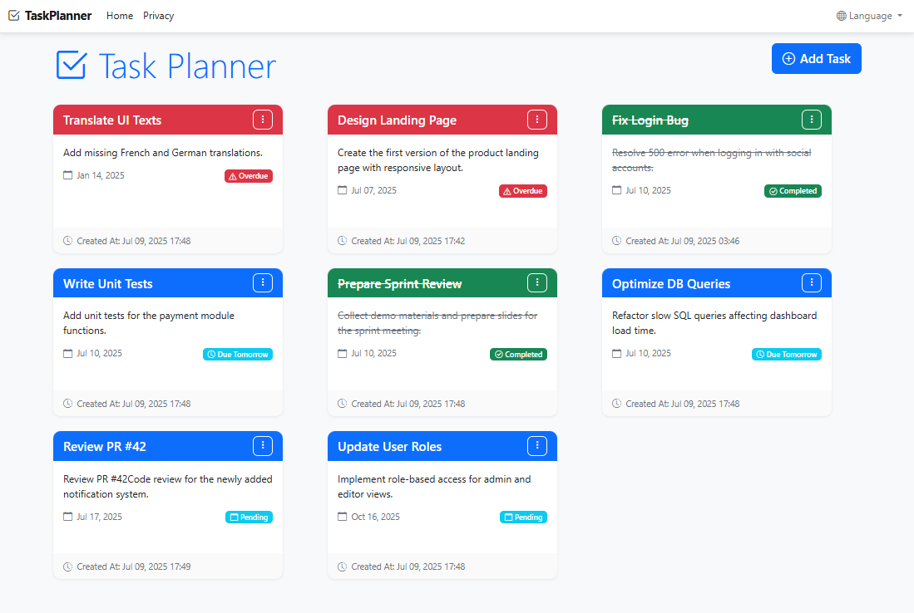

# Task Planner

## Screenshots


*Main dashboard view with tasks in various states*

A modern, responsive task management application built with ASP.NET Core and Razor Pages. This application allows users to create, edit, delete, and track the completion status of tasks with a beautiful Bootstrap-based UI.

## Features

### Core Functionality
- ✅ **Add Tasks**: Create new tasks with title, description, and due date
- ✅ **Edit Tasks**: Modify existing task details
- ✅ **Delete Tasks**: Remove tasks with confirmation
- ✅ **Mark as Completed**: Toggle task completion status
- ✅ **Task Status Tracking**: Visual indicators for overdue, due today, and pending tasks

### User Interface
- 🎨 **Modern Bootstrap UI**: Clean, responsive design with Bootstrap 5
- 📱 **Mobile Responsive**: Optimized for all device sizes
- 🎯 **Visual Status Indicators**: Color-coded cards for different task states
- 🔄 **Smooth Animations**: Hover effects and transitions for better UX
- 📊 **Task Cards**: Beautiful card-based layout for task display

### Localization
- 🌍 **Multi-language Support**: English and Ukrainian languages
- 🔄 **Language Switcher**: Easy language switching via dropdown
- 📝 **Localized Messages**: All user-facing text is localized

### Data Storage
- 💾 **File-based Storage**: JSON file storage for simplicity
- 🔒 **Thread-safe Operations**: Concurrent access protection
- 📁 **Automatic Data Directory**: Creates necessary folders automatically

## Technology Stack

- **Backend**: ASP.NET Core 8.0
- **Frontend**: Razor Pages with Bootstrap 5
- **Storage**: JSON file-based storage
- **Localization**: ASP.NET Core Localization
- **Icons**: Bootstrap Icons
- **Styling**: Custom CSS with modern design patterns

## Getting Started

### Prerequisites
- .NET 8.0 SDK or later
- Visual Studio 2022, VS Code, or any .NET-compatible IDE

### Installation

1. **Clone or Download** the project files

2. **Navigate to the project directory**:
   ```bash
   cd TaskPlanner
   ```

3. **Restore dependencies**:
   ```bash
   dotnet restore
   ```

4. **Run the application**:
   ```bash
   dotnet run
   ```

5. **Open your browser** and navigate to:
   ```
   https://localhost:7001
   ```
   or
   ```
   http://localhost:5000
   ```

### Project Structure

```
TaskPlanner/
├── Models/
│   └── Task.cs                 # Task entity model
├── Services/
│   ├── ITaskService.cs         # Task service interface
│   └── FileTaskService.cs      # File-based task service implementation
├── Pages/
│   ├── Index.cshtml            # Main task list page
│   ├── Index.cshtml.cs         # Main page model
│   └── Tasks/
│       ├── Create.cshtml       # Create task page
│       ├── Create.cshtml.cs    # Create page model
│       ├── Edit.cshtml         # Edit task page
│       └── Edit.cshtml.cs      # Edit page model
├── Resources/
│   ├── SharedResource.en.resx  # English localization
│   └── SharedResource.uk.resx  # Ukrainian localization
├── wwwroot/
│   └── css/
│       └── site.css            # Custom styles
└── Data/
    └── tasks.json              # Task data storage (auto-created)
```

## Usage

### Creating a Task
1. Click the "Add Task" button on the main page
2. Fill in the task details:
   - **Title** (required): Brief description of the task
   - **Description** (optional): Detailed information about the task
   - **Due Date** (required): When the task should be completed
3. Click "Save" to create the task

### Managing Tasks
- **Edit**: Click the three-dot menu on any task card and select "Edit Task"
- **Mark Complete**: Use the toggle option in the task menu
- **Delete**: Select "Delete Task" from the menu (requires confirmation)

### Switching Languages
- Use the language dropdown in the top navigation bar
- Choose between English (en) and Ukrainian (uk)

### Task Status Indicators
- 🟢 **Green**: Completed tasks
- 🔴 **Red**: Overdue tasks
- 🟡 **Yellow**: Tasks due today
- 🔵 **Blue**: Pending tasks

## Data Storage

Tasks are stored in a JSON file located at `Data/tasks.json`. The file is automatically created when the first task is added. The storage system includes:

- **Thread Safety**: Uses semaphores to prevent concurrent access issues
- **Error Handling**: Graceful handling of file I/O errors
- **Data Validation**: Input validation and error messages
- **Automatic Backup**: Data is preserved between application restarts

## Customization

### Adding New Languages
1. Create a new `.resx` file in the `Resources` folder
2. Name it `SharedResource.{culture}.resx` (e.g., `SharedResource.fr.resx` for French)
3. Add the culture to the supported cultures in `Program.cs`
4. Add all required keys and translations

### Styling Modifications
- Edit `wwwroot/css/site.css` for custom styles
- Modify Bootstrap classes in Razor pages for layout changes
- Update color schemes by modifying CSS variables

### Adding New Features
- Extend the `Task` model for additional properties
- Update the `ITaskService` interface and implementation
- Create new Razor pages for additional functionality

## Development

### Building for Production
```bash
dotnet build --configuration Release
```

### Running Tests (if applicable)
```bash
dotnet test
```

### Publishing
```bash
dotnet publish --configuration Release --output ./publish
```

## Contributing

1. Fork the repository
2. Create a feature branch
3. Make your changes
4. Test thoroughly
5. Submit a pull request

## License

This project is open source and available under the MIT License.

## Support

For issues, questions, or contributions, please open an issue in the project repository.

---

**Built with ❤️ using ASP.NET Core and Bootstrap** 

## Localization & TempData Troubleshooting

### Correct Usage of Localized Strings
- When using `IStringLocalizer` to retrieve localized messages for use in `TempData` or `ModelState.AddModelError`, **always use the `.Value` property**:
  ```csharp
  TempData["SuccessMessage"] = _localizer["TaskCreated"].Value;
  ModelState.AddModelError("", _localizer["ErrorUpdatingTask"].Value);
  ```
- **Do not** store the `LocalizedString` object directly in `TempData` or `ModelState`, as this will cause serialization errors at runtime.

### Common Error
If you see an error like:
```
The 'Microsoft.AspNetCore.Mvc.ViewFeatures.Infrastructure.DefaultTempDataSerializer' cannot serialize an object of type 'Microsoft.Extensions.Localization.LocalizedString'.
```
This means you are storing a `LocalizedString` object instead of its `.Value` property. Update your code to use `.Value` as shown above.

### Adding New Languages
1. Create a new `.resx` file in the `Resources` folder
2. Name it `SharedResource.{culture}.resx` (e.g., `SharedResource.fr.resx` for French)
3. Add the culture to the supported cultures in `Program.cs`
4. Add all required keys and translations 